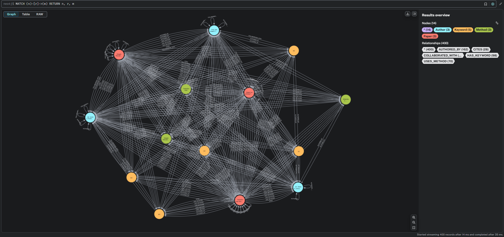

# GraphRAG Neo4j Research Framework

A comprehensive research framework for building Graph-based Retrieval-Augmented Generation (GraphRAG) systems using Neo4j as the knowledge graph backend.

## 🚀 Features

- **Graph-based RAG**: Leverage Neo4j's graph database for enhanced retrieval
- **ArXiv Integration**: Automated paper ingestion and processing
- **Vector Search**: Hybrid search combining graph traversal and vector similarity
- **Interactive Visualization**: Built-in graph visualization tools
- **Performance Optimized**: Efficient data processing and retrieval pipelines
- **Type Safety**: Full mypy type checking support

## 📋 Requirements

- Python 3.8+
- Neo4j Database
- CUDA-compatible GPU (optional, for enhanced performance)

## 🛠️ Installation

### 1. Clone the Repository
```bash
git clone https://github.com/your-username/GraphRAG-Neo4j-Research-Framework.git
cd GraphRAG-Neo4j-Research-Framework
```

### 2. Set Up Environment
```bash
# Create conda environment
conda env create -f environment.yml

# Or install with pip
pip install -r requirements.txt
```

### 3. Configure Neo4j
1. Install and start Neo4j Desktop or Neo4j Community Edition
2. Create a new database
3. Set environment variables:
   ```bash
   export NEO4J_URI="bolt://localhost:7687"
   export NEO4J_USER="neo4j"
   export NEO4J_PASSWORD="your_password"
   ```

### 4. Initialize the System
```bash
python scripts/system_setup.py
```

## 🏗️ Project Structure

```
GraphRAG-Neo4j-Research-Framework/
├── src/                    # Core application code
│   ├── app/               # Streamlit web application
│   ├── data_ingestion/    # Data ingestion modules
│   ├── database/          # Database initialization and management
│   ├── graph_rag/         # GraphRAG implementation
│   └── visualization/     # Graph visualization tools
├── scripts/               # Utility scripts
│   ├── arxiv_scraper.py
│   ├── database_refresher.py
│   ├── database_viewer.py
│   ├── graph_visualizer.py
│   ├── system_setup.py
│   └── vector_index_builder.py
├── tools/                 # Development and maintenance tools
├── tests/                 # Test suite
├── docs/                  # Documentation
├── notebooks/             # Jupyter notebooks
└── images/                # Project images
```

## 🚀 Quick Start

### 1. Start the Application
```bash
streamlit run src/app/main.py
```

### 2. Ingest ArXiv Papers
```bash
python scripts/arxiv_scraper.py --query "graph neural networks" --max_results 100
```

### 3. Build Vector Index
```bash
python scripts/vector_index_builder.py
```

### 4. Visualize Knowledge Graph
```bash
python scripts/graph_visualizer.py
```

## 📚 Usage Examples

### Basic GraphRAG Query
```python
from src.graph_rag.orchestrator import GraphRAGOrchestrator

# Initialize the orchestrator
orchestrator = GraphRAGOrchestrator()

# Perform a query
response = orchestrator.query("What are the latest developments in graph neural networks?")
print(response)
```

### Custom Data Ingestion
```python
from src.data_ingestion.arxiv_ingestion import ArxivIngestion

# Ingest papers from ArXiv
ingestion = ArxivIngestion()
papers = ingestion.search_papers("machine learning", max_results=50)
ingestion.process_and_store(papers)
```

## 🔧 Configuration

### Environment Variables
- `NEO4J_URI`: Neo4j connection URI
- `NEO4J_USER`: Neo4j username
- `NEO4J_PASSWORD`: Neo4j password
- `OPENAI_API_KEY`: OpenAI API key for LLM integration
- `HUGGINGFACE_TOKEN`: HuggingFace token for model access

### Performance Tuning
See `docs/PERFORMANCE_IMPROVEMENTS.md` for detailed performance optimization guidelines.

## 🧪 Testing

Run the test suite:
```bash
python -m pytest tests/
```

Run specific test categories:
```bash
python tests/test_arxiv_scraper.py
python tests/test_performance.py
```

## 📖 Documentation

- **Setup Guide**: `docs/setup_environment.md`
- **Performance**: `docs/PERFORMANCE_IMPROVEMENTS.md`
- **Troubleshooting**: `docs/TROUBLESHOOTING.md`
- **Validation**: `docs/VALIDATION_GUIDE.md`
- **Architecture**: `docs/PROJECT_STRUCTURE.md`

## 🤝 Contributing

1. Fork the repository
2. Create a feature branch (`git checkout -b feature/amazing-feature`)
3. Commit your changes (`git commit -m 'Add amazing feature'`)
4. Push to the branch (`git push origin feature/amazing-feature`)
5. Open a Pull Request

## 📄 License

This project is licensed under the MIT License - see the LICENSE file for details.

## 🙏 Acknowledgments

- Neo4j for the graph database platform
- ArXiv for providing research paper access
- The open-source community for various dependencies

## 📞 Support

For support and questions:
- Open an issue on GitHub
- Check the troubleshooting guide in `docs/TROUBLESHOOTING.md`
- Review the validation guide in `docs/VALIDATION_GUIDE.md` 
